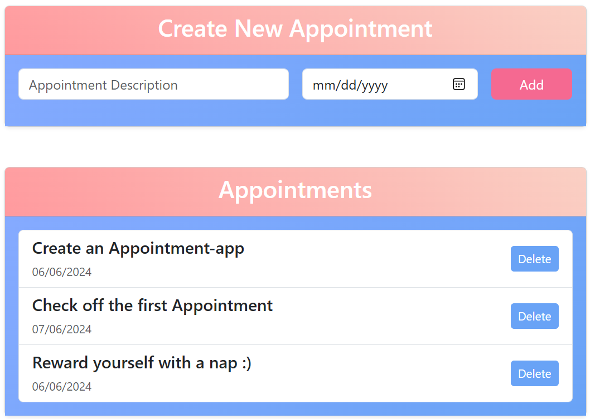

# Angular Appointment Scheduler


This Angular application allows users to create and manage appointments.

## Features

- Create new appointments with a description and date.
- View a list of all appointments.
- Delete appointments.

## Getting Started

To run this application locally, follow these steps:

1. Clone the repository:

   ```bash
   git clone https://github.com/zerotwos02/appointment-app.git
   ```

2. Install dependencies:

   ```bash
   cd your-repository
   npm install
   ```

3. Run the development server:

   ```bash
   npm start
   ```

   The application will be available at `http://localhost:4200`.

## Usage

- **Create New Appointment**: Fill out the form on the homepage with a description and date, then click "Add".
- **View Appointments**: All appointments are listed on the homepage.
- **Delete Appointment**: Click the "Delete" button next to an appointment to remove it from the list.

## Technologies Used

- Angular
- TypeScript
- HTML/CSS
- Bootstrap

## Author

ZeroTwo <3 - [Your Website](https://zer0tw0.com/)

## License

This project is licensed under the MIT License - see the [LICENSE](LICENSE) file for details.
```

